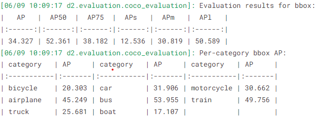

# Semi-Supervised Object Detection

This is our computer vision project 

link drive for report and weight of models: https://drive.google.com/drive/folders/1WCGLPBoWY2ovkOcNZLrQ5jC0fDF_u5uJ

Project aim: leverage both labeled and unlabeled data to improve the performance of object detection models, utilizing a combination of a small set of labeled data and a larger set of unlabeled data

## Dataset

- Full-Dataset: COCO(Common Objects in Context) 2017 version, for more information of dataset can be found here: https://cocodataset.org/#home

- 2017 version we use taken from kaggle which can be found here: https://www.kaggle.com/datasets/awsaf49/coco-2017-dataset

- Dataset we use is part of COCO 2017 version which only contain category vehicle mean 8 objects have id from 2 to 9
  you can find more information in this: https://www.kaggle.com/datasets/minmints/semis-od-coco-10/data, we divide by .json file
  filtered_instances_train2017.json is file for all annotations of our dataset
  instances_train2017_unlabeled_predicted.json in yolov9semi is file annotation predict by yolov9 have purpose for take advantage of unlabel dataset

## Infer

Alternative method, you can run our `demovida.ipynb` for all of these

## Models

## Some outstanding Results 

### Retina 1530 student and YoLov9 Teacher

<td>

`Retina 1530` model's mAP

### Unbiased Teacher with FasterRCNN-R50

<td>

`Unbiased Teacher` model's mAP
